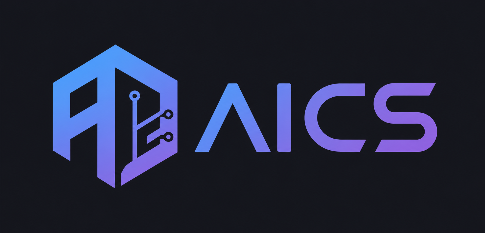

<figure markdown>
  { width="750" }
</figure>

# 前言

这是一本AI时代的计算机自学指南，也是对自己大学四年自学生涯的一个记录。

这同时也是献给全球计算机技术学生的礼物。如果这本指南能对大家哪怕一丝一毫的帮助，都是对我极大的鼓励和慰藉。

本书目前包含了以下部分（如果你有更好的建议，或者想加入贡献者行列，欢迎邮箱 1578991667@qq.com 或者在issue里提问）：

- 本书使用指南：由于书内涵盖资源众多，我根据不同人群的空闲时间和学习目标制定了对应的使用指南。
- 一份供参考的AI-CS 学习规划：我根据自己的自学经历制定的全面的、系统化的 AI时代的CS 自学规划。
- 必学工具：一些 AI-CSer 效率工具介绍，例如 IDE, 翻墙, StackOverflow, Git, GitHub, Vim, LaTeX, GNU Make, Docker, 工作流 等等。
- 经典书籍推荐：你是否苦于教材的晦涩难懂不知所云？别从自己身上找原因了，可能只是教材写得太烂。看过 CSAPP 这本书的同学一定会感叹好书的重要，我将列举推荐各个计算机领域的必看好书与资源链接。
- **国内外高质量 CS 课程汇总**：我将把我上过的以及开源社区贡献的**高质量**的国内外 CS 课程分门别类进行汇总，介绍其课程内容特点并给出相应的自学建议，大部分课程都会有一个独立的仓库维护相关的资源以及作业实现供大家学习参考。

## 齿轮开始转动的地方--Buildathon

入学时我是一个对计算机一窍不通的小白，除了玩过电脑游戏，我甚至不会下载正规的软件。但我还是怀着新奇和热情开始了我的计算机科学之路。每天我都会按时去教室，认真听取老师的讲课，做好笔记，然后完成任务。然后，我逐渐发现，每个老师的教学方式不同，速度不同，侧重点不同，热情不同。有的仅仅是照着陈旧的ppt复述，有的仅仅是增加了抽人回答ppt上的问题，真正热情投入教育让学生批判性思考的非常少，我的热情逐渐被消磨掉.....我本以为我的大学会这样平淡，上课、学习、娱乐。没两个月，deepseek横空出世。起初我觉得没什么，只是多了一个能帮助我的非常全能的工具。我仍然想往常一样，按照计算机四大件的顺序啃教材。直到快进入大二，我终于意识到了这个专业的变故。学习仍然重要，但是专业知识已经发生了翻天覆地的变化。从deepseek开始，到后来的agent，再到后来的skills，RAG。一个个新的概念和学科悄然兴起，从传统的人工代码开发到如今的AI辅助编程和Vibe Coding，计算机学科教育发生了翻天覆地的变化。

因为这样，我也曾陷入迷茫，我一度怀疑我是不是不适合学计算机，因为童年对于极客的所有想象，已经被我第一个学年的体验彻底粉碎了。我时常问自己，AI既然能做这么多，我究竟应该掌握什么知识？我还需要学习Java、Python吗？我还需要去学习数据结构、计算机网络吗？

转机发生在大一结束，我无意了解到吴恩达大佬在首届Buildathon上发表的主题演讲，演讲围绕AI辅助编程、快速开发产品原型，以及AI工程师技能需求，让我真正找到了学习计算机科学的方向。我去YouTube看了吴恩达演讲的全过程，看完的那个瞬间，就像哥伦布发现了新大陆一样，我开启了新世界的大门。

在吴恩达的演讲里，我整理了几个重要思想：

- **“快速行动，承担责任”**。AI辅助编程让独立原型开发实现10倍加速。原型成本大幅降低使快速多次试错成为可行策略，真正价值在于在试错中发现值得深度开发的项目。

- **代码正在贬值，开发者需要转型为系统设计者和AI指挥者**。编程工具已经历多代进化：从GitHub Copilot到IDE，再到高度代理化的程助手。工具迭代速度创造实质性效率差距，落后半代即可能显著影响产出能力。代码价值本身正在降低。AI可自动生成代码、迁移数据库架构，使架构决策变得更可逆。开发者需要从代码编写者转型为系统设计者和AI指挥者，重点把控核心架构与复合型系统构建。

- **“AI时代无需学编程”是史上最糟的职业建议**。吴恩达强烈反对“AI时代无需学编程”的观点，指出历史上每次编程工具进步都让更多人群具备编程能力。他团队中的CFO、法律顾问、前台人员均通过学习编程提升工作效率。未来核心技能是“精准告诉计算机该做什么”，这需要理解计算机语言与编程逻辑。非技术人员可通过AI辅助快速掌握基础编程能力，实现跨领域效率提升。

- **AI工程师奇缺，大学课程却已严重脱节**。计算机专业毕业生失业率升至7%，可企业却仍面临AI工程师严重短缺。核心矛盾在于大学课程未能及时覆盖关键技能：AI辅助编程、大语言模型调用、RAG/Agentic工作流构建、规范错误分析流程等。新兴AI工程师需掌握三大技能：使用最新AI编程工具、熟悉AI构建模块（提示工程/评估技术/MCP）、具备快速原型能力与基础产品直觉。

  

后来，我按照吴恩达教授给我们的建议，按照这些方向去自学。我逐渐放弃了大学的课堂，并在此期间我找到了很多优质的网络课程，在这样的课程中，你完全不需要任何顾虑，你只需要努力、认真、花时间就够了。此前在课堂上那种有劲没处使的感觉，那种付出再多时间却得不到回报的感觉，从此烟消云散。这太适合我了，我从此爱上了自学。

如果你也在不开心的学习计算机知识，和我有着同样的苦恼，不妨去看看吴恩达教授在[Buildathon上的演讲](https://youtu.be/kjg45_5WhqI?si=lcWv2E-pLhF-5StY)，因为那是我命运的齿轮开始转动的地方。

## 为什么写这本指南

在我大二秋季学期学习计算机操作系统的时候，我发现老师讲这门课讲的极其枯燥，而且很多是十年前的例子，实验课的指南更是13年前的。在后来和身边朋友的交谈中，我也能感受到大家对于AI快速发展的担忧和对未来工作就业焦虑。那时候，我已经自学一年多了，自己也整理了很多资源，我将其分享给了我的朋友们，毕竟，谁不希望能快乐的度过大学时光，还能找到一份好工作或者考上研究生呢？

但随着又一年时间的积累，资源的内容已经相当丰富，基本覆盖了计科、智能系、软工系的绝大多数课程，我也为每个课程都建了各自的 GitHub 仓库，汇总我用到的自学资料以及作业实现。直到后来计算学分时，我打开自己的培养方案，我发现它已经是我这个自学仓库的子集了，而这距离我开始自学也才两年而已。于是，一个大胆的想法在我脑海中浮现：也许，我可以打造一个自学式的培养方案，把我这三年自学经历中遇到的坑、走过的路记录下来，同时结合自己对于AI时代的思考，以期能为后来的CSers贡献自己的一份微薄之力。

## 自学还是？

自学最大的好处就在于可以完全根据自己的进度来调整学习速度。你可以随时改变自己的学习计划。按照自己的进度，而不是局限在培养方案和课堂。

自学的另一个好处是博采众长。我第一次在笔记本装双系统时就犯了错，将我的windows给抹除了，唯一庆幸的是我没有什么贵重的资料，后来又了解到现代固态硬盘不会彻底消除数据，也就是说数据可能还没有被完全覆盖，只要我的新系统没有占有原有的磁盘的那部分空间，我就有可能恢复未被占用空间的数据。也正是这些试错让我能不断学习到各种平时接触不到的知识。

自学的第三个好处是时间自由，大学本就相对自由，自学更是可以安排自己学习的时间和计划。只要时间安排得当，你仍然能一边自学，一边取得一个好成绩。

自学有什么坏处吗？当然，凡事有利必有弊。

自学第一个坏处就是不便沟通，你遇到的问题，未必就有人遇到，并且未必就有人感兴趣。然后，善于借助google，stackoverflow和AI等平台提问，我相信可以解决你90%的问题。第二个坏处是很多优质的课程和资源是英文的，但是我相信这已经不是一个很难解决的问题了，如今翻译软件和插件几乎已经完美解决了这个问题。第三个，也是最难的一个问题就是自律，对于自学而言，没有DDL真是一件可怕的事，随着学习内容的深入，学习难度也会上升，坚持学完整个课程是相当虐的。你得有足够的驱动力强迫自己静下心来，理解上千行的代码框架，忍受数个小时的 debug 时光。而这一切，没有学分，没有绩点，没有老师，没有同学，只有一个信念 —— 你在变强。

## 这本书为谁而写

正如我在前言里说的，任何有志于在AI时代学好用好计算机知识的朋友都可以参考这本书。如果你已经有了一定的计算机基础，只是对某个特定的领域感兴趣，可以选择性地挑选你感兴趣的内容进行学习。当然，如果你是一个像我当年一样对计算机一无所知的小白，初入大学的校门，我希望这本书能成为你的攻略，让你花最少的时间掌握你所需要的知识和能力。某种程度上，这本书更像是一个根据我的体验来排序的课程搜索引擎，帮助大家足不出户，体验计算机优质课程。

## 特别鸣谢

在这里，我怀着崇敬之心真诚地感谢所有将课程资源无偿开源的各位教授和开发者们。这些课程和资源倾注了他们数十年教学生涯的积淀和心血，他们却选择无私地让所有人享受到如此高质量的 CS 教育。没有他们，我的大学生活不会这样充实而快乐。很多教授在我给他们发了感谢邮件之后，甚至会回复上百字的长文，真的让我无比感动。他们也时刻激励着我，做一件事，就得用心做好，无论是学习、科研、还是为人。

## 你也想加入到贡献者的行列

一个人的力量终究是有限的，这本书也是我在繁重的科研之余熬夜抽空写出来的，难免有不够完善之处。另外，由于个人做的是计算机应用方向，很多课程侧重计算机应用实践，对于数学、理论计算机、高级算法相关的内容则相对少些。如果有大佬想在其他领域分享自己的自学经历与资源，可以直接在项目中发起 Pull Request，也欢迎和我邮件联系（[1578991667@qq.com](mailto:1578991667@qq.com)）。

## 关于交流群的建立

本书支持页面评论功能，因此如果你想自学某课程，可以自己建立群聊后（QQ 微信皆可）在对应的课程页面下方发表评论，注明你的学习目标以及加入交流群的途径。此外，过去已有不少朋友在 issue 里建立了类似群聊，可以自行选择直接加入。

## 请作者喝杯下午茶

本书的内容是完全开源免费的，如果你觉得该项目对你真的有帮助，可以给仓库点个 star 或者请作者喝一杯下午茶。

<figure markdown>
  { width="500" }
</figure>
